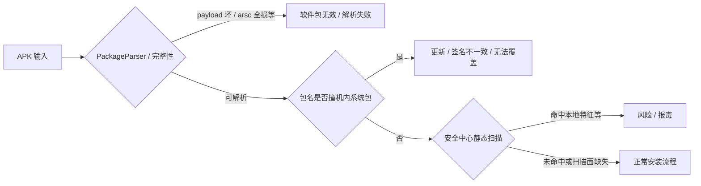

# 安装前扫描差分研究报告（5412ce7f 探针矩阵）

**输入样本**：`apk-shield/input/5412ce7f.apk`  
**包名**：`org.helper.scannertask`  
**原证显示名**：`Rivo TV`（来自 `resources.arsc`，非包名字符串）  
**研究目的**：在自研安全中心上，通过编号 APK 差分，区分「安装器报错 / 系统更新冲突 / 风险拦截」各走哪条链路，并定位**离线仍生效**的检测依据。  
**观测方式**：仅记录**安装前**提示；能否运行、是否闪退不作为主指标。  
**矩阵工具**：`python3 build_install_matrix.py` → `output/install-test/{N}.apk` 与 `说明.md`

---

## 1. 结论摘要

| 问题 | 结论 |
|------|------|
| **当时报毒主要是因为什么？** | 在能正常进入安装流程的样本上，**一旦 APK 内重新出现与原样本同源的 `resources.arsc`（资源表）即报毒**（59、61、65）；仅 `res/**` 无 arsc（60）、仅 v4 HTML（62–64）、仅改 Manifest application 名（57–58）、换包名且无 arsc（66–68）均**不报**。说明当前引擎**强绑定「编译后资源表指纹」**，而非单独依赖安装界面上的应用名。 |
| **没联网也报毒，是有特征库吗？** | **是，表现为本地即可触发的特征/规则**（与 59/61/65 现象一致）：捐回 arsc 后立即报毒，无需依赖网络拉取。具体实现可能是**本地 hash 黑名单、arsc 结构化特征、整包/similarity 指纹或与原包 1 共用的静态库条目**；本差分**不能**区分是「整包 MD5」还是「arsc 子文件 hash」，但能排除「纯云端、离线必不报」这一种。 |
| **56 为什么不报？** | 56 在最小加壳 Manifest 基础上去掉 `res/`、`resources.arsc` 及除 `assets/apk-shield/` 外全部 assets，**安装前扫描缺少 arsc 这一主特征面**；明文 `classes.dex` 仅为 ~17KB 壳 stub，真实 DEX 在加密 `payload.blp` 内，**若引擎不解壳、不扫大体积 assets/native，则与「空壳包」同类**。 |
| **仿系统更新页有没有用？** | 在当前规则下 **62–64 均正常**，说明 **`assets/v4screens/*.html` 尚未成为安装前拦截主因**（规则缺口，非样本无风险）。 |
| **9 / 23 / 35 / 39 等特殊提示** | 9：payload 抹零 → **包无效**（完整性）；23：arsc 抹零 → **解析失败**；35/39 等：**包名撞系统应用** → **更新/签名冲突**，勿计入病毒规则权重。 |

---

## 2. 样本与加壳基线（便于读矩阵）

- **原包 1**：全权限 Manifest、明文大 DEX、`resources.arsc` + `res/`、`assets/v4screens/` 仿系统页、`libadb.so` 等 → 安装前**报风险/毒**（与 1–6 类现象一致）。
- **最小壳 7**：Manifest 剥 `uses-permission` + 去掉无障碍 Service 声明，DEX 进 payload，**资源面仍完整** → 仍报毒（与 1 同量级静态面）。
- **56 基准**：在 7 上再删 `res/`、`resources.arsc`、业务 assets（**保留** `assets/apk-shield/payload.blp`）→ **不报毒**（你已实测）。
- **57–68**：在 56 上**逐项加回**显示名、arsc、res、v4 HTML、包名等（见第 4 节表）。

---

## 3. 提示类型三分法（避免混评）



- **C、E 类**：不是「病毒引擎」结论，矩阵中 **9、23、35、39** 等用于校准文案归属。  
- **G 类**：本报告重点；**59/61/65** 属于在 **F** 阶段命中。

---

## 4. 以 56 为基准的递加结果（你的实测）

基准：**56 不报毒**。下列为相对 56 的变化与你的结果。

| # | 相对 56 加回/变化 | 安装前报毒 | 解读 |
|---|-------------------|------------|------|
| 57 | Manifest 名 **Rivo TV** | （未报，推断同 56） | 仅 application 硬编码名；列表名仍多依赖 `@ref`，**不足以触发当前毒库** |
| 58 | Manifest 名 **系统更新** | （未强调报毒；**应用管理难找**） | 仅 `<application label>`；组件仍为 `@0x7f10001e` 且无 arsc → **设置里常显示包名** `org.helper.scannertask`，不是「找错」 |
| 59 | 只捐 **`resources.arsc`** | **报毒** | **决定性因素：资源表指纹** |
| 60 | 只捐 **`res/**`**（无 arsc） | **不报** | 引擎**基本不**对散装 `res/` 做与 arsc 同级判定 |
| 61 | **res + arsc** | **报毒** | 再次确认 **arsc 存在即报** |
| 62 | 只捐 **v4screens HTML** | 正常 | HTML 规则未接或未加权 |
| 63 | 只捐 **dexopt** | 正常 | 非主特征 |
| 64 | v4 + Manifest **Rivo** | 正常 | 仍无 arsc → 不触发主库 |
| 65 | res + arsc + v4 + 名 | **报毒** | 与 59/61 一致，**主因仍是 arsc** |
| 66 | 包名 **a8**，形态同 56 | 正常 | 无 arsc 时换包名**不能单独**触发 |
| 67 | 66 + Manifest **Rivo** | 正常 | 同上 |
| 68 | 中性包 + **Rivo** | 正常 | 同上 |

**归纳**：报毒必要条件是（在当前规则版本下）**APK 内带有与原样本一致的 `resources.arsc`**；不是「名字叫系统更新」，也不是「仅有仿更新 HTML」。

---

## 5. 「离线也报毒」说明什么？

差分设计里，**59 只从本地捐赠 APK 复制 arsc 并重签**，不引入新网络请求；你侧 **仍报毒**，可推断：

1. **安装前扫描不依赖实时联网**即可给出与 1/7 同类的毒性结论（至少对 arsc 这条路径）。  
2. 更符合 **本地特征库 / 本地规则引擎**，例如（可并存，后续应用 69–71 再拆）：  
   - **`resources.arsc` 文件 hash 或分段 hash** 命中黑名单；  
   - **资源表内字符串/包名/图标 id 组合** 的结构化签名；  
   - **整包 hash**（若 59 与 1 的 arsc 相同，整包 hash 也变，需与「仅 arsc 字节相同」对照实验）；  
   - **包名 + 证书 + arsc 联合键**（66–68 无 arsc 时不报，说明在「无 arsc」分支上包名 alone 未触发同一键）。  
3. **不能**据此说「一定是云端」；应说：**离线可用的静态特征已足够在你样本上复现报毒**。  
4. **56 的漏报**与 **59 的报毒** 同框说明：同一套引擎里存在 **「无 arsc → 扫描路径过窄或默认放行」** 的策略 bug，而不是「没有特征库」。

---

## 6. 报毒主因 vs 非主因（给规则改权重）

| 信号 | 权重（基于本次差分） | 备注 |
|------|----------------------|------|
| `resources.arsc` 与原样本同源 | **极高** | 59/61/65 vs 56/60/62–64 |
| 完整 `uses-permission` + 组件 Manifest（1/7） | 高（与 arsc 共现） | 7 已剥权限仍报，说明 **permission  alone 不是 7 的主因**；56 去掉 arsc 后不报，**decisive 仍是 arsc 面** |
| `assets/v4screens/*.html` | **当前低/未生效** | 62–64 |
| 散装 `res/` 无 arsc | **当前低** | 60 |
| Manifest `application` 显示名 | **当前低** | 57–58、64 |
| 包名 `org.helper.scannertask`（无 arsc） | **当前低** | 66–68 |
| 加密 `payload.blp` + 壳 DEX | **未作为安装前主特征** | 56 不报 |
| `libadb.so` 等 native | **未验证为安装前主特征** | 56 仍含 lib，不报 |

---

## 7. 引擎问题清单（产品向）

1. **缺少 arsc 时不应等价于安全**（56、66–68）；应降级为「无法完整扫描」并增加 Manifest / 大 assets / native / 壳 payload 启发式。  
2. **过度依赖 arsc 单点**（59 即报）；攻击者可去 arsc 绕过当前库，**60 已证明 res-only 路径存在盲区**。  
3. **v4screens 未拦截**（62–64）；建议在 assets 路径与 HTML 关键词上加规则，与 arsc 解耦。  
4. **加密载荷与壳 stub DEX** 未进入安装前模型；56 与 1 风险差过大。  
5. **58 类 UX**：仅改 application label、组件仍 `@ref` 且无 arsc → 安装器与设置展示不一致；属 Manifest 探测设计问题，与安全中心无关。

---

## 8. 矩阵编号速查（全量 1–68）

- **1–6**：原包 / 重签 / 加壳 / Manifest 权限消融。  
- **7–30**：壳损伤、queries、换包名、组合损伤。  
- **31–40**：显示名与系统型包名（35/39 易走系统更新提示，不作毒判）。  
- **41–48**：中性包、a8+壳、arsc 尾损等。  
- **49–56**：物理删除 res/assets/lib/arsc；**56 = 不报毒基准**。  
- **57–68**：从 56 **递加** 名/arsc/res/v4/包名（见第 4 节）。

生成命令：

```bash
cd apk-shield
python3 build_install_matrix.py              # 1–68
python3 build_install_matrix.py 56 59 60 65  # 最小对照组
```

---

## 9. 原包 arsc 深度探针（69–76，已实现）

以 **2 = 原包重签** 为基准（与 **1** 内容相同、开发签名）：

| # | 构造 | 要回答的问题 |
|---|------|----------------|
| **69** | 仅 **删除** `resources.arsc`（保留 res/assets/dex/lib） | 是否「只要有 arsc 就报」→ 若 2 报、69 不报，则 **arsc 文件本身** 是主因 |
| **70** | 仅删 `res/**`，**保留 arsc** | 与 69 正交：散装 res 是否足够 |
| **71** | arsc **末字节翻转**（其余同 2） | 若 2 报、71 不报 → **整文件 hash 黑名单**；若仍报 → **解析内容/结构特征** |
| **72** | 删 arsc + 删 res | 资源面全去、仍明文 DEX |
| **73** | 69 + Manifest 大剥 | 无 arsc 时 Manifest 是否还能触发 |
| **74** | arsc **条目仍在但全 0** | 对比 69（无条目） |
| **75** | 56 + 原样 arsc 再 **翻转 1 字节** | 对照 59 |
| **76** | 56 + **翻转后的 arsc** | 对照 59/75 |

生成：`python3 build_install_matrix.py 2 69 70 71 74 75 76`

**说明**：69 与矩阵 **52** 构造相同；52 若未测，以 **69** 为准即可。

---

## 10. 声明

本报告基于**登记测试样本**与**自研安全中心差分观测**，用于合规边界内的无障碍与安装扫描研究；差分结果描述的是**当前引擎行为**，不构成对第三方杀软或商用云查的断言。  

**报告版本**：与仓库内探针矩阵 1–68 及 2026-09-24 会话实测（56 基准，57–68 递加）一致。  

若你补充 **57、58 是否报毒** 的明确结果，可回填第 4 节表格并收窄「Manifest 名」权重。
